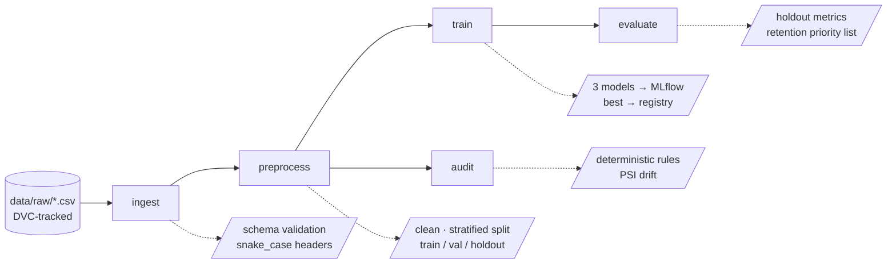

# Customer Churn Prediction — MLOps Pipeline


An end-to-end MLOps pipeline for predicting customer churn, built for the
MLOps mid-term (STDE 301, Vijaybhoomi School of Science and Technology).

The modelling problem is straightforward binary classification. The engineering
around it is the point: versioned data, tracked experiments, a reproducible
pipeline, an automated test suite, and CI that runs on every push and pull
request.

---

## Reproducing this project

Four commands from a clean clone:

```bash
git clone https://github.com/PreeyasTumulu/MLOpsMID_predicting_customer_churn.git
cd MLOpsMID_predicting_customer_churn
conda env create -f environment.yml
conda activate churn-mlops
uv pip install -r requirements.txt
dvc repro
```

**About the data.** `data/raw/` is DVC-tracked, so the CSVs are not in this
repository — only their `.dvc` pointers. The configured DVC remote is a local
folder on the original developer's machine, so `dvc pull` will not reach it from
elsewhere. To obtain the data, either:

1. download the two CSVs from
   [Kaggle](https://www.kaggle.com/datasets/muhammadshahidazeem/customer-churn-dataset)
   into `data/raw/` under their original filenames, or
2. point DVC at your own remote with `dvc remote add -d <name> <url>`.

Once the raw files are present, `dvc repro` rebuilds everything.

**Verifying reproducibility.** Run `dvc repro` a second time — every stage
should report `didn't change, skipping`. DVC compares the hash of each stage's
dependencies, parameters, and outputs, so an unchanged input never re-runs.

---

## Pipeline



| Stage | Command | Produces |
|---|---|---|
| `ingest` | `python -m src.data.ingest` | `data/interim/{train,test}.csv` |
| `preprocess` | `python -m src.data.preprocess` | `data/processed/{train,val,test}.csv` |
| `train` | `python -m src.models.train` | `models/best_model.pkl`, `reports/metrics.json` |
| `evaluate` | `python -m src.models.evaluate` | `reports/test_metrics.json`, `reports/high_risk_customers.csv` |
| `audit` | `python -m src.monitoring.audit` | `reports/data_audit.json` |

All five run together via `dvc repro`.

---

## Results

Three models, trained on 352,665 rows and scored on a held-out 88,167-row
validation fold. **Recall is the primary metric** — a missed churner costs a
customer, a false positive costs one retention email.

| Model | Accuracy | Precision | Recall | F1 | ROC-AUC | False neg. | Fit |
|---|---|---|---|---|---|---|---|
| Logistic regression | 0.8712 | 0.9149 | 0.8522 | 0.8824 | 0.9443 | 7,389 | 0.6 s |
| Random forest | 0.9992 | 0.9999 | 0.9987 | 0.9993 | 1.0000 | 66 | 15.1 s |
| **Hist. gradient boosting** | **1.0000** | **1.0000** | **1.0000** | **1.0000** | **1.0000** | **2** | 7.9 s |

The winner is registered in the MLflow Model Registry as `churn_classifier`.

### Those perfect scores are a property of the data, not a bug

A ROC-AUC of 1.0000 normally means target leakage. Here it does not, and the
`audit` stage proves it. The training master contains **four independent
threshold rules that each imply churn with 100% purity**:

| Rule | Train churn rate | Coverage | Holdout churn rate | Generalises? |
|---|---|---|---|---|
| `support_calls >= 6` | 1.0000 | 94,876 (26.9%) | 0.6099 | ❌ |
| `total_spend <= 491.17` | 1.0000 | 90,617 (25.7%) | 0.5211 | ❌ |
| `payment_delay >= 21` | 1.0000 | 67,260 (19.1%) | 0.7660 | ❌ |
| `age >= 51` | 1.0000 | 65,462 (18.6%) | 0.5293 | ❌ |

The label in the training master is effectively a boolean OR of hard
thresholds, which any tree-based model recovers exactly. **None of the four
rules hold on the holdout master**, because the two files in the Kaggle dataset
were generated differently.

`customer_id` is excluded from the feature matrix, and
`test_preprocessor_excludes_the_identifier` asserts it never reaches an
estimator — so leakage through the identifier is ruled out structurally.

### Performance on the shifted holdout

Scoring the winning model on the holdout master (64,374 rows, 47.4% churn
against 56.7% in training):

| Metric | Validation | Holdout | Δ |
|---|---|---|---|
| Accuracy | 1.0000 | 0.5033 | **−0.4967** |
| Precision | 1.0000 | 0.4881 | **−0.5119** |
| Recall | 1.0000 | 0.9987 | −0.0013 |
| F1 | 1.0000 | 0.6557 | **−0.3442** |
| ROC-AUC | 1.0000 | 0.7362 | **−0.2638** |

The model applies its memorised training rules to a different population and
flags 96.9% of customers as churners against a true rate of 47.4%. Recall stays
high because it flags nearly everyone; precision collapses. A retention team
working that list would be calling coin flips.

Population Stability Index confirms the two populations differ:

| Feature | PSI | Verdict | Train mean → Holdout mean |
|---|---|---|---|
| `support_calls` | 0.3818 | **major shift** | 3.61 → 5.40 |
| `payment_delay` | 0.2711 | **major shift** | 12.97 → 17.13 |
| `total_spend` | 0.1611 | moderate shift | 631.89 → 541.02 |
| `age` | 0.1032 | moderate shift | 39.38 → 41.97 |
| `last_interaction` | 0.0167 | stable | 14.48 → 15.50 |
| `usage_frequency` | 0.0111 | stable | 15.82 → 15.08 |
| `tenure` | 0.0033 | stable | 31.24 → 31.99 |

By the usual convention (PSI > 0.25 triggers retraining) two features are over
the line. **This is the pipeline's monitoring capability working on its first
run**, not an afterthought: it detects the degradation, quantifies it, and logs
it to MLflow alongside the training runs.

### Prioritising retention

`reports/high_risk_customers.csv` ranks the top 500 customers by churn
probability, with a `priority` column. A ranked list is what makes the output
usable — a team with capacity for 500 calls needs to know *which* 500, not that
30,000 customers are "at risk". Adjust the size with `evaluate.top_n_high_risk`
in `params.yaml`.

---

## Experiment tracking

MLflow logs every run: hyperparameters, five metrics, raw confusion counts, fit
time, confusion-matrix and ROC plots, and the fitted pipeline with a signature.

```bash
mlflow ui --backend-store-uri sqlite:///mlflow.db --workers 1
```

Then open <http://127.0.0.1:5000>.

Two flags that are not optional on this setup:

- **`--backend-store-uri sqlite:///mlflow.db`** — MLflow 3.x put the old
  `./mlruns` file store into maintenance mode and raises on it. SQLite is also
  the only backend that can serve the Model Registry.
- **`--workers 1`** — on Windows, uvicorn's default multi-worker mode cannot
  share the listening socket and crashes with `WinError 10022`.

---

## Testing

```bash
pytest                                   # 91 tests
pytest --cov=src --cov-report=term-missing
```

**Every test runs on synthetic fixtures.** No test reads `data/raw` or
`data/processed`, because those are DVC-tracked and absent on the CI runner. A
test that opened the real CSV would pass locally and fail in CI. The suite was
verified green in a clone with `data/`, `models/`, and `reports/` deleted, and
the CI workflow re-checks that no CSV is present on the runner.

Coverage is 56% overall, with the metric maths at 100%. The uncovered lines are
the `main()` orchestration functions, which read files and talk to MLflow —
integration paths that require the data by definition.

Selected tests worth noting:

| Test | Guards against |
|---|---|
| `test_preprocessor_excludes_the_identifier` | Leakage via `customer_id` |
| `test_train_val_split_is_reproducible` | Non-deterministic splits |
| `test_model_learns_better_than_chance` | A pipeline that runs but stopped learning |
| `test_find_deterministic_rules_recovers_the_planted_rule` | A broken audit detector |
| `test_compute_metrics_omits_roc_auc_without_probabilities` | Fabricated metrics |

---

## Continuous integration

`.github/workflows/ci.yml` runs on **every push to any branch** and **every
pull request**. Steps: checkout → Python 3.12 → install uv → install from the
lock → `ruff check` → `pytest --cov` → verify no datasets are present.

CI installs with uv from the same `requirements.txt` lock used locally, so the
runner and a developer machine resolve to identical package versions.

---

## Project layout

```
├── .github/workflows/ci.yml     CI: lint + test on push and PR
├── data/
│   ├── raw/                     DVC-tracked; only .dvc pointers in git
│   ├── interim/                 schema-validated (pipeline output)
│   └── processed/               train / val / holdout (pipeline output)
├── src/
│   ├── config.py                params.yaml loading, path resolution
│   ├── data/ingest.py           schema validation, header normalisation
│   ├── data/preprocess.py       cleaning, splitting, feature transformer
│   ├── models/train.py          multi-model training + MLflow logging
│   ├── models/evaluate.py       holdout scoring, retention ranking
│   ├── models/metrics.py        metric computation, diagnostic plots
│   └── monitoring/audit.py      deterministic-rule and drift detection
├── tests/                       91 tests, synthetic fixtures only
├── reports/                     metrics, audit, figures, priority list
├── params.yaml                  every seed, path, and hyperparameter
├── dvc.yaml                     the 5-stage pipeline
├── requirements.in              hand-edited dependency source
├── requirements.txt             uv-compiled lock (164 packages)
└── environment.yml              conda: Python 3.12 interpreter only
```

---

## Design decisions

**`params.yaml` is the only place a value is defined.** No path, seed, or
hyperparameter is hard-coded downstream. Each DVC stage declares which
parameter sections it depends on, so changing `seed` invalidates exactly the
stages that use it.

**The feature transformer is fitted inside the pipeline, never before the
split.** `build_preprocessor()` returns an *unfitted* `ColumnTransformer` that
`train.py` composes into a `Pipeline`. Fitting a `StandardScaler` before
splitting leaks validation statistics into training and inflates every reported
metric. Composing it also means the saved model carries its own preprocessing,
so inference cannot drift from training.

**`contract_length` is ordinal, not one-hot.** Monthly &lt; Quarterly &lt; Annual
is real ordering information that one-hot encoding discards.

**Histogram gradient boosting over the classic `GradientBoostingClassifier`.**
The exact-split implementation takes tens of minutes on 350k rows; the binned
version is the same algorithm family built for data this size.

**Conda supplies only the interpreter; uv owns the packages.** `requirements.in`
holds hand-written intent and compiles via
`uv pip compile --universal` into a fully-pinned `requirements.txt`. Universal
mode matters because development is on Windows and CI runs on Linux — a
platform-specific lock would carry Windows-only pins and break the runner.

To change a dependency, edit `requirements.in` and recompile — never hand-edit
`requirements.txt`:

```bash
uv pip compile requirements.in -o requirements.txt --universal --python-version 3.12
```

---

## Requirements coverage

| # | Requirement | Where |
|---|---|---|
| 1 | Ingest and preprocess customer data | `src/data/ingest.py`, `src/data/preprocess.py` |
| 2 | Train and evaluate multiple models | `src/models/train.py` — 3 models, 5 metrics each |
| 3 | Track datasets and data changes with DVC | `data/raw/*.dvc`, `dvc.yaml`, local remote |
| 4 | Track experiments with MLflow | `src/models/train.py`, SQLite store + Model Registry |
| 5 | Automated unit tests with Pytest | `tests/` — 91 tests |
| 6 | Git for version control | This repository |
| 7 | GitHub Actions on push and PR | `.github/workflows/ci.yml` |
| 8 | Reproducible by another developer | `dvc repro`, `params.yaml`, pinned lock, `dvc.lock` |
